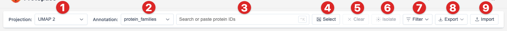
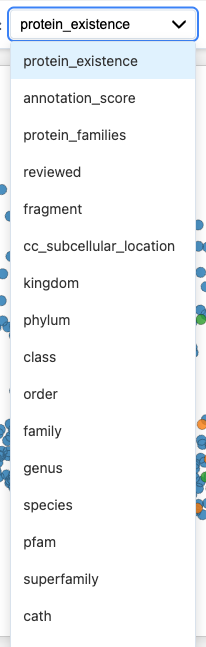
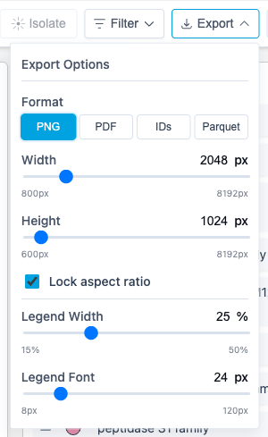

# Control Bar Features

The control bar at the top provides tools for data management, selection, export, and import.

## 1. Projection Selector

Switch between different dimensionality reduction methods:

| Method     | Best For                           |
| ---------- | ---------------------------------- |
| **PCA**    | Initial overview, finding outliers |
| **UMAP**   | General exploration, balanced view |
| **t-SNE**  | Finding clusters                   |
| **PaCMAP** | Fast alternative to t-SNE          |
| **MDS**    | Preserving distances               |

Different projections reveal different patterns - try switching between them!

## 2. Color By (Annotation Selector)

Choose which annotation to use for coloring points:

Available annotations depend on your dataset (taxonomy, family, function, etc.).

## 3. Search

Find specific proteins by ID:

1. Type a protein ID or partial match
2. Select from suggestions
3. Protein is selected in the scatterplot

::: tip Multiple IDs
Paste multiple IDs at once (newline or space separated) and all matching proteins will be selected. Useful for re-selecting a previously exported subset.
:::

## 4. Select Button

Enable **box selection mode** to select multiple proteins at once. See the [Box Selection](/explore/scatterplot#box-selection) section for details.

## 5. Clear Button

Click **Clear** to remove all current selections.

## 6. Isolate Button

Click **Isolate** to focus on your selected proteins by hiding all unselected proteins from the view:

1. Select one or more proteins using the search or select tools
2. Click **Isolate** to filter the view
3. Only selected proteins remain visible in the scatterplot
4. Click **Reset** (appears when isolated) to restore the full dataset

This is useful for focusing on a specific subset of proteins and exploring their relationships in detail.

## 7. Filter

Use the **Filter** dropdown to filter proteins by feature values:

1. Click **Filter** to open the filter menu
2. Select one or more features to filter by (e.g., taxonomy, family)
3. Choose specific values for each feature
4. Click **Done** to apply the filter

Filtered proteins will be highlighted with a custom color scheme, making it easy to see which proteins match your criteria.

## 8. Export

Click **Export** to save your visualization:

| Format          | Description                                  |
| --------------- | -------------------------------------------- |
| **PNG**         | Raster image                                 |
| **PDF**         | Vector image                                 |
| **JSON**        | Full data for isolated proteins              |
| **Protein IDs** | Text file with newline-separated identifiers |

## 9. Import

Click **Import** to load a `.parquetbundle` file from your computer.

You can also drag & drop files directly onto the canvas.

## Tips

- **Compare projections**: Patterns that appear in multiple projections are more reliable
- **Use search**: Quickly find known proteins to orient yourself
- **Export often**: Save interesting views for later

## Next Steps

- [Viewing 3D Structures](/explore/structures) - AlphaFold integration
- [Exporting Results](/explore/exporting) - Detailed export options
