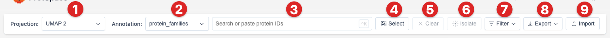
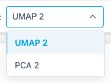
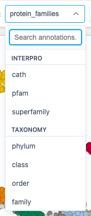
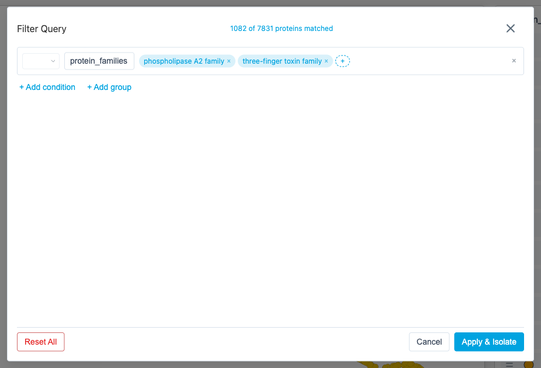
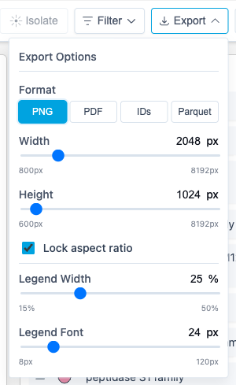

# Control Bar Features

The control bar at the top provides tools for data management, selection, export, and import.

## 1. Projection Selector

Switch between different dimensionality reduction methods:

| Method     | Best For                           |
| ---------- | ---------------------------------- |
| **PCA**    | Initial overview, finding outliers |
| **UMAP**   | General exploration, balanced view |
| **t-SNE**  | Finding clusters                   |
| **PaCMAP** | Fast alternative to t-SNE          |
| **MDS**    | Preserving distances               |

Different projections reveal different patterns - try switching between them!

::: info URL persistence
Your current projection is reflected in the page URL, so refresh, browser back/forward navigation, and shared links reopen the same view when possible. A bare `/explore` URL stays unchanged on first load; ProtSpace writes projection and annotation params after you change the view or when it needs to normalize an invalid URL value.
:::

::: tip 3D Projections
When a 3D projection is available, a **plane selector** (XY / XZ / YZ) appears, letting you view different 2D slices of the 3D space.
:::

## 2. Annotation Selector

Choose which annotation to use for coloring points:

The Annotation dropdown features:

- **Grouped categories**: Features are organized into sections (UniProt, InterPro, Taxonomy, Other)
- **Search**: Type to filter features by name (case-insensitive)
- **Keyboard navigation**: Use arrow keys to navigate, Enter to select, Escape to close

Only categories present in your dataset appear in the dropdown. Any columns that don't match a known category appear under **Other**. See the [ProtSpace Python package](https://github.com/tsenoner/protspace) for the complete list of available annotations per source.

::: info Shareable view state
The selected annotation is also stored in the page URL together with the current projection. This makes the current Explore view shareable and restorable across refreshes without reloading the page.
:::

::: info Tooltip-only annotations
`gene_name`, `protein_name`, and `uniprot_kb_id` are excluded from the dropdown but are still shown in the [tooltip](/explore/scatterplot#protein-tooltip) on hover.
:::

## 3. Search

Find specific proteins by ID:

1. Click inside the search box or press **⌘/Ctrl + K** to focus it
2. Type a protein ID or partial match
3. Select from suggestions
4. Protein is selected in the scatterplot

::: tip Multiple IDs
Paste multiple IDs at once (newline or space separated) and all matching proteins will be selected. Useful for re-selecting a previously exported subset.
:::

## 4. Selection Tools

Click **Select** to enter selection mode. A tool picker appears with two options:

- **Rectangle** (default) — drag to draw a box around proteins
- **Lasso** — draw a freeform outline around proteins

See [Box Selection](/explore/scatterplot#box-selection) and [Lasso Selection](/explore/scatterplot#lasso-selection) for details.

## 5. Clear Button

Click **Clear** (or press **Escape**) to remove all current selections. Pressing **Escape** again will exit selection mode.

## 6. Isolate Button

**Isolate** focuses on selected proteins by hiding all others:

1. Select one or more proteins (using search, click, or box select)
2. Click **Isolate**
3. Only selected proteins remain visible
4. Click **Reset** (appears when isolated) to restore all proteins

::: tip Use Case
Isolate is useful for examining relationships within a specific protein subset - hiding unrelated proteins reduces visual clutter.
:::

## 7. Filter Button

**Filter** opens a query builder modal for building complex annotation-based filters:

1. Click **Filter** to open the query builder
2. Each row is a condition: select an annotation, then click **+** to pick values
3. Combine conditions with **AND**, **OR**, or **NOT** logic
4. Use **+ Add group** for nested logic (parenthetical grouping)
5. The live match count shows how many proteins match your query
6. Click **Apply & Isolate** to filter the scatterplot

Close the modal with the **×** button, **Cancel**, **Escape** key, or clicking the backdrop.

**Reset All** clears the query and restores all proteins without closing the modal.

::: tip Logical Operators

- **AND**: Protein must match both conditions
- **OR**: Protein must match either condition
- **NOT**: Protein must NOT match the condition (negation)

The first condition can optionally be set to **NOT** for immediate negation.
:::

::: info Filter vs Isolate
Both reduce visible proteins, but they work differently:

- **Filter**: Build annotation-based queries (e.g., "show all Human AND reviewed proteins")
- **Isolate**: Manually select proteins first, then hide everything else

Use **Filter** for structured queries. Use **Isolate** for ad-hoc selections.
:::

## 8. Export

Click **Export** to save your visualization:

| Format          | Description                                               |
| --------------- | --------------------------------------------------------- |
| **PNG**         | Raster image with legend                                  |
| **PDF**         | PDF document with legend                                  |
| **Protein IDs** | Text file with newline-separated identifiers              |
| **Parquet**     | `.parquetbundle` file with all data and optional settings |

See [Exporting Results](/explore/exporting) for image customization options (dimensions, legend size, font).

## 9. Import

Click **Import** to load a `.parquetbundle` file from your computer.

You can also drag & drop files directly onto the scatterplot.

## Tips

- **Compare projections**: Patterns that appear in multiple projections are more reliable
- **Use search**: Quickly find known proteins to orient yourself
- **Export often**: Save interesting views for later

## Next Steps

- [Viewing 3D Structures](/explore/structures) - AlphaFold integration
- [Exporting Results](/explore/exporting) - Detailed export options
