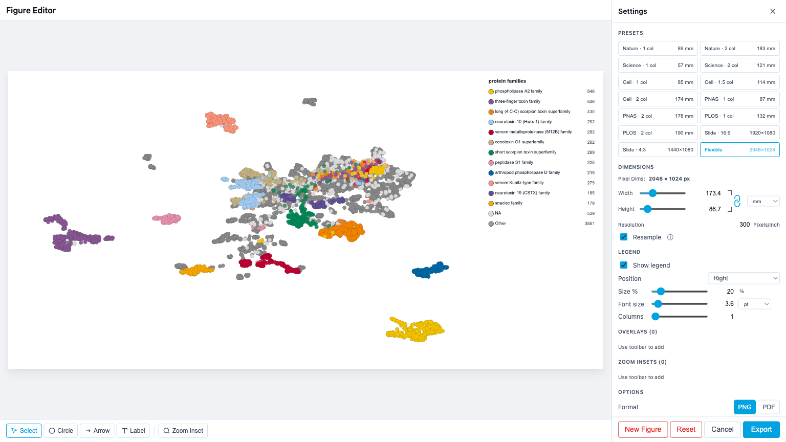

# Figure Editor

The Figure Editor is a full-screen tool for creating publication-ready figures from your ProtSpace visualization. It provides live preview, journal-specific dimension presets, overlays, zoom insets, and legend customization — all in a single interface.



## Opening the Figure Editor

1. Click **Export** in the control bar
2. With **PNG** or **PDF** selected, click **Figure Editor**

The editor opens as a full-screen modal with a **preview canvas** on the left and a **settings sidebar** on the right.

To export immediately with the last-used settings, use **Quick Export** instead — it skips the editor.

## Journal Presets

The presets grid configures dimensions and DPI for specific journals:

| Preset        | Width   | DPI | Max Height |
| ------------- | ------- | --- | ---------- |
| Nature 1 col  | 89 mm   | 300 | 247 mm     |
| Nature 2 col  | 183 mm  | 300 | 247 mm     |
| Science 1 col | 57 mm   | 300 | —          |
| Science 2 col | 121 mm  | 300 | —          |
| Cell 1 col    | 85 mm   | 300 | 225 mm     |
| Cell 1.5 col  | 114 mm  | 300 | 225 mm     |
| Cell 2 col    | 174 mm  | 300 | 225 mm     |
| PNAS 1 col    | 87 mm   | 300 | 225 mm     |
| PNAS 2 col    | 178 mm  | 300 | 225 mm     |
| PLOS 1 col    | 132 mm  | 300 | 222 mm     |
| PLOS 2 col    | 190 mm  | 300 | 222 mm     |
| Slide 16:9    | 1920 px | 96  | 1080 px    |
| Slide 4:3     | 1440 px | 96  | 1080 px    |
| Flexible      | 2048 px | 300 | —          |

When you apply a journal preset:

- **Width is pinned** to the journal's mm value. The Width input is disabled.
- **Height stays adjustable** up to the preset's max-height (where one is defined). Going beyond clamps to the cap.
- **Your existing aspect ratio is preserved** when possible. If the resulting height exceeds the cap, height clamps to the cap.
- **The aspect-lock chain is disabled and shown as broken**, because rescaling width to follow height would violate the preset.
- **Resample is forced ON** for the preset application. A small note appears if it had been off.

Pick **Flexible** to leave width and height fully editable.

## Dimensions panel

The Dimensions section is modeled on Photoshop's Image Size dialog. Width and Height are linked through a chain icon, all values share a single unit, and a **Resample** toggle controls whether changing one value rebuilds pixels or only metadata.

### Width / Height

Each has both a slider for quick adjustment and an input for precise values. The unit is whatever the **Unit** toggle is set to. Pixel range is 400 – 8192. While a journal preset is active, the Width input is disabled and any maxHeight cap clamps the Height.

### DPI

72 – 1000 dots per inch. With a journal preset active, DPI is fully editable but Width-mm stays locked: changing DPI rescales Width-px to keep the same physical width.

### Resample toggle

| Resample | What changing DPI does                 | What changing Width/Height does |
| -------- | -------------------------------------- | ------------------------------- |
| **ON**   | Rebuilds pixels at the new resolution  | Pixels change, mm follows       |
| **OFF**  | Only metadata changes; pixels stay put | Pixels change, mm follows       |

Use **Resample OFF** when you've already produced a figure at the right pixel count and just want to tag it with a different DPI for print sizing — no re-rendering.

When Resample is OFF and you click a preset, the editor auto-flips it back ON (a small note flashes) so the preset can apply.

### Unit toggle

Switch the Width/Height inputs between **px**, **mm**, **in**, **cm**. Internally pixels are the source of truth; the unit only affects how values are displayed and entered.

### Aspect-lock chain

The vertical chain icon between Width and Height links the two values. When **locked** (default), editing one rescales the other to preserve the aspect ratio. Click the chain to unlink.

The chain is automatically broken and disabled while a journal preset pins width — relinking is meaningless when one side cannot move. Switching to Flexible re-enables it.

## Legend

Control how the legend appears in the exported figure:

| Setting     | Range                          | Default | Description                                                         |
| ----------- | ------------------------------ | ------- | ------------------------------------------------------------------- |
| Show legend | on/off                         | on      | Toggle legend visibility                                            |
| Position    | right, left, top, bottom, free | right   | Legend placement relative to the plot                               |
| Size %      | 10–100%                        | 20%     | Legend area as percentage of image width (or height for top/bottom) |
| Font size   | unit-aware (see below)         | ~15 px  | Font size for legend text                                           |
| Font unit   | pt / px                        | pt      | What unit the font-size input is in                                 |
| Columns     | 1–6                            | 1       | Number of columns for legend items                                  |

### Font size unit (pt / px)

The font size input lets you type values in either **pt** (typographic points, what journals usually require) or **px**. The internal source of truth is pixels; pt is derived from the current DPI:

```
pt = px × 72 / DPI
```

If you change DPI later, pt-entered sizes stay correct in physical terms — the px count rescales automatically.

### Legend positions

- **Side positions** (right, left, top, bottom) — the legend occupies a dedicated strip alongside the plot. The plot area shrinks accordingly.
- **Free** — the legend floats over the plot. Drag it anywhere on the canvas using the Select tool.

### Legend rendering

- **Underscore removal** — underscores in annotation names and category labels are replaced with spaces.
- **Text wrapping** — long category labels wrap within their column width.
- **Per-item shapes** — the legend renders each category's actual shape (circle, square, diamond, triangle-up/down, plus), matching the scatterplot.
- **Corner positions** (tr, tl, br, bl) — available programmatically; the legend overlays the plot with a semi-transparent white background.

## Selecting items (canvas + sidebar)

Selection is a single concept that the canvas and sidebar share. An item is either selected or it isn't, and exactly one item can be selected at a time.

You can select an item in three ways:

- **Click it on the canvas** with the Select tool
- **Click its row in the sidebar** under "Overlays" or "Zoom Insets"
- **Drag a handle on the canvas** (this implicitly selects)

The selected item is highlighted in the sidebar and gets resize/rotate handles on the canvas. Click empty canvas to deselect.

### Removing items

| Key                           | Effect                                            |
| ----------------------------- | ------------------------------------------------- |
| **Delete** or **Backspace**   | Remove the currently selected overlay or inset    |
| **Escape**                    | Clear the selection (item stays)                  |
| **× button on a sidebar row** | Remove that specific row, regardless of selection |

While focus is inside an editable input (e.g. a label's text field), Delete/Backspace edit text as usual — they don't remove the overlay.

## Overlay tools

The toolbar at the bottom of the preview switches between drawing tools.

### Select tool

Click items on the canvas or in the sidebar to select them. Drag a selected item to move it. Drag handles to resize or rotate. See [Selecting items](#selecting-items-canvas-sidebar) above for keyboard shortcuts.

### Circle tool

Click and drag to draw an ellipse. The center is placed at mouse-down, radius extends to release. After creation, the Select tool exposes:

- 4 cardinal handles to resize rx/ry independently
- A rotate handle (above the top handle) to rotate the ellipse
- The body to drag the whole shape

### Arrow tool

Click and drag from start to end. The arrowhead appears at the end point. After creation, the Select tool exposes:

- Circle handles at each endpoint to reposition
- The shaft to drag the whole arrow

### Label tool

Click to place a text label. Default text is "Label" and can be renamed in the sidebar. After creation, the Select tool exposes:

- The body to drag
- A rotate handle for rotation around the anchor

### Zoom-inset tool

Creates a magnified view of a region. Two-phase workflow:

1. **Draw the source rectangle** — drag to select the region you want to magnify
2. **Draw the target rectangle** — drag to place where the magnified view should appear (its aspect ratio locks to the source)

After creation, the inset shows:

- A dashed outline around the source region
- The magnified content in the target rectangle with a solid border
- Connector lines between the closest corner pair

The connector logic auto-picks 2 of the 4 corner pairs based on the relative position of source and target.

#### Geometric zoom (true vector-quality magnification)

Insets are rendered as a **fresh WebGL pass scoped to the source's data domain** at the target rectangle's exact pixel size. Points keep native pixel size — the inset is not a raster crop-and-upscale, so quality keeps improving as the inset's pixel budget grows instead of plateauing at a fixed boost factor.

While you drag-resize an inset, redraws are throttled to the browser's animation frames. Very fast resizes reuse the last fresh render (slightly stretched) for instant feedback, then a fresh full-resolution render is computed once activity settles.

#### Dot size slider

Each inset has its own **Dot size** slider (0.5×–20×, default **2×**) that scales the rendered dot size inside the zoomed view, relative to the main plot:

- **1×** — dots match the main plot's pixel size
- **>1×** — dots are larger, useful when you've zoomed deep into a sparse region
- **<1×** — dots are smaller

This affects the inset only, not the main plot.

## Per-overlay properties

Each overlay row in the sidebar has editable properties:

| Overlay | Properties                              |
| ------- | --------------------------------------- |
| Circle  | Stroke width (0.5–10 px)                |
| Arrow   | Stroke width (0.5–10 px)                |
| Label   | Text content, font size (8–72 px)       |
| Inset   | Dot size (0.5×–20×), Border (0.5–10 px) |

All overlays default to black (`#000000`). Click the row to select it; click the × button to delete it.

## Options

- **Format** — toggle between PNG and PDF output
- **Background** — white or transparent (PNG only; PDF always has a white background)

### PNG output

Exported PNGs include a `pHYs` chunk encoding the configured DPI. Image editors (Photoshop, Illustrator, Inkscape, GIMP) will open them at the correct physical size for print.

### PDF output

The PDF page size is computed exactly from the configured Width/Height in mm at the configured DPI, so the document opens at the intended physical dimensions in any PDF viewer.

## Footer buttons

| Button         | Action                                                                                                                                                                               |
| -------------- | ------------------------------------------------------------------------------------------------------------------------------------------------------------------------------------ |
| **New Figure** | Clears all overlays and insets but keeps layout settings (dimensions, DPI, preset, legend, format). Useful when you've changed the underlying visualization and want a fresh canvas. |
| **Reset**      | Resets everything to defaults — dimensions, DPI, preset, legend, overlays, insets, format, background.                                                                               |
| **Cancel**     | Closes the editor. Your current state is saved to localStorage.                                                                                                                      |
| **Export**     | Renders the figure at full resolution and downloads it. State is saved to localStorage.                                                                                              |

## State persistence

The Figure Editor saves your settings automatically so you can close and reopen without losing work.

### Where state is stored

1. **localStorage** — saved on every close and export. Restored when you reopen the editor in the same browser.
2. **Parquet bundle** — when you export a `.parquetbundle` with "Include legend settings" checked, the Figure Editor state is included. Anyone who loads the file gets your figure layout.

Priority on open: bundle settings > localStorage > defaults.

### What is saved

All settings persist: preset, dimensions, DPI, format, background, **resample**, **aspect-lock**, **unit**, legend layout (position, size, font, font unit, columns, free position), overlays (type, position, properties), insets (source rect, target rect, border, connector, dot-size scale), and the reference width for overlay scaling.

Saved state passes through a sanitizer on load: malformed entries (out-of-range coords, unknown overlay/preset types, non-finite numbers, dimensions above the canvas cap) are dropped or replaced with defaults rather than crashing the editor.

### View fingerprint

The editor records which projection and dimensionality (2D/3D) was active when overlays were placed. If you change the projection or dimensionality between sessions, a warning appears:

> "Overlays were placed on UMAP 2D. Current view: PaCMAP 2D."

This means overlay positions (stored as normalized 0–1 coordinates over the plot area) may no longer align with the data. You can:

- **Keep working** — overlays stay where they are
- **Clear overlays** — remove stale overlays, keep the layout

## Coordinate system

All overlay and inset positions use **normalized 0–1 coordinates** within the plot area:

- Overlays survive resolution changes (switching presets, changing width/height)
- Overlays survive DPI changes
- Overlays do **not** survive projection changes (the data moves, but overlay positions don't)

Pixel-based properties (stroke width, font size) are scaled proportionally when the output width differs from the width at which they were authored (`referenceWidth`).

## Keyboard and mouse

| Action                          | Effect                                          |
| ------------------------------- | ----------------------------------------------- |
| Click overlay backdrop          | Close the editor                                |
| Click × in sidebar header       | Close the editor                                |
| Click toolbar button            | Switch active tool                              |
| Click sidebar overlay/inset row | Select that item                                |
| Click an item on the canvas     | Select that item                                |
| **Delete** / **Backspace**      | Remove the selected item (skipped while typing) |
| **Escape**                      | Clear the selection                             |
| Drag on canvas (drawing tool)   | Create overlay/inset                            |
| Drag on canvas (select tool)    | Move selected item                              |
| Drag handle (select tool)       | Resize/rotate selected item                     |
| Drag legend (free position)     | Move legend on canvas                           |
