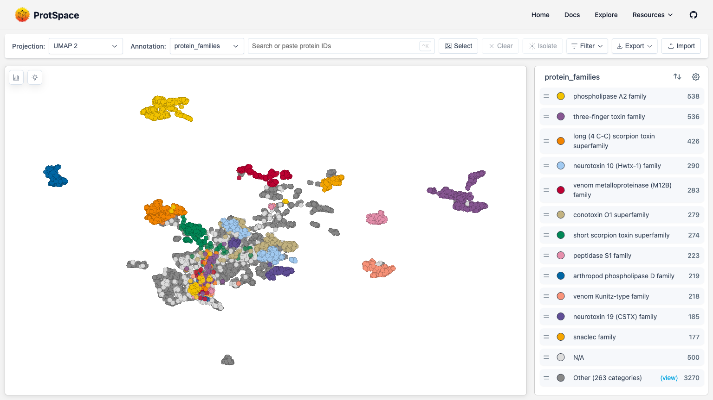
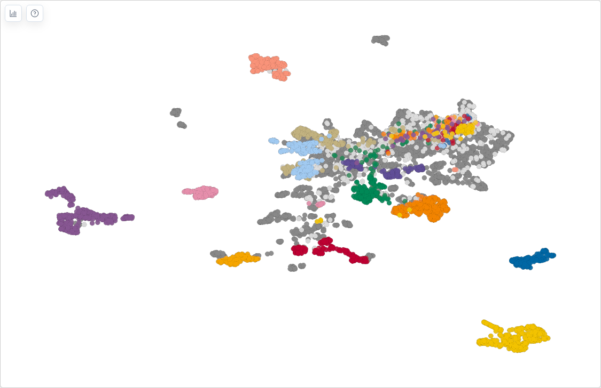
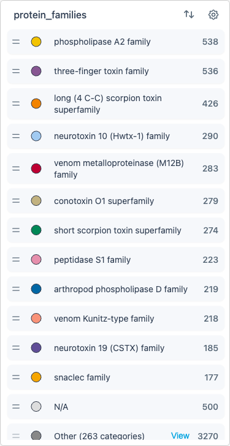
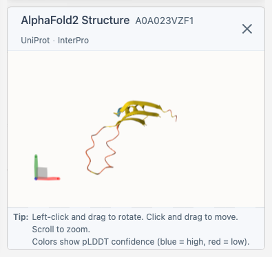

# Interface Overview

The ProtSpace Explore page provides an interactive environment for visualizing and analyzing protein embeddings.

## Page Layout

| Area                 | Location      | Purpose                                                    |
| -------------------- | ------------- | ---------------------------------------------------------- |
| **Control Bar**      | Top           | Switch projections, change coloring, search, import/export |
| **Scatterplot**      | Center        | Main 2D visualization of protein embeddings                |
| **Legend**           | Right sidebar | Filter categories, customize display                       |
| **Structure Viewer** | Right sidebar | View 3D protein structures (when available)                |

## Control Bar

The control bar contains:

- **Projection dropdown** - Switch between PCA, UMAP, t-SNE, etc.
- **Annotation dropdown** - Change how points are colored by annotation
- **Search box** - Find specific proteins by ID
- **Select button** - Enable box selection mode
- **Clear button** - Clear current selection
- **Isolation button** - Isolate current selection
- **Export button** - Save images or data
- **Import button** - Load a `.parquetbundle` file

## Scatterplot

The main visualization shows your proteins as points in 2D space. Points close together have similar embeddings.

**Quick interactions:**

- **Scroll** to zoom in/out
- **Drag** to pan around
- **Click** a point to select it
- **⌘/Ctrl + click** to add to selection
- **Double-click** canvas to reset view

## Legend

The legend shows the current coloring scheme:

- Click labels to hide/show categories
- Drag labels to reorder (changes z-order in canvas)
- Use the settings cog for advanced options

## Structure Viewer

When you select a protein, the 3D viewer appears and fetches its structure from AlphaFold (if available). The viewer includes direct links to the [AlphaFold Database](https://alphafold.ebi.ac.uk/) and [UniProt](https://www.uniprot.org/) entries for the selected protein.

## Next Steps

- [Importing Data](/explore/importing-data) - Load your protein data
- [Navigating the Scatterplot](/explore/scatterplot) - Learn navigation controls
- [Using the Legend](/explore/legend) - Filter and customize display
