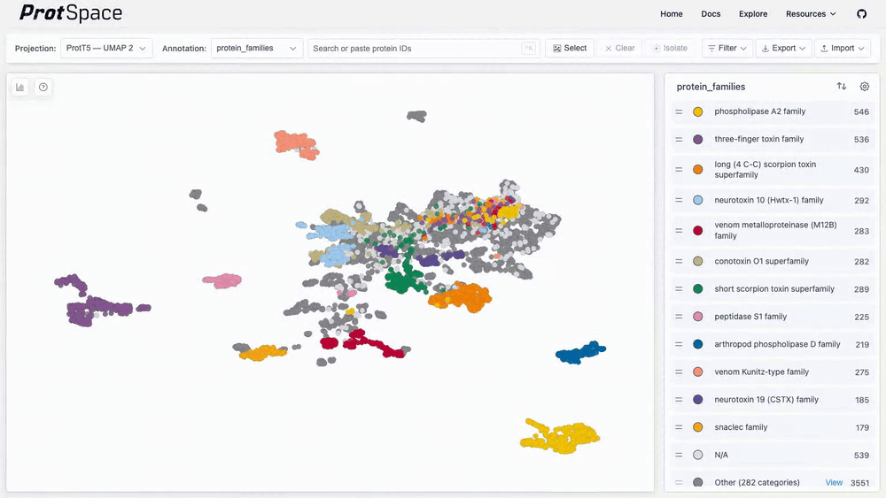
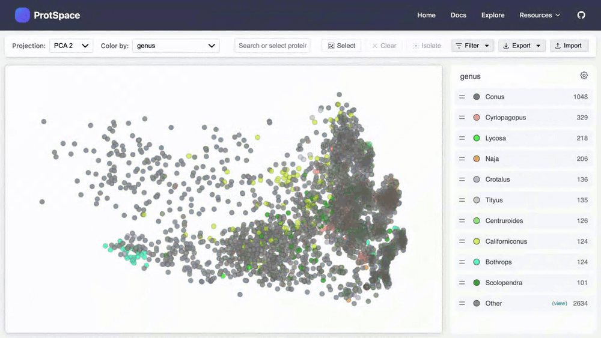

# Using the Legend

The legend panel lets you filter, customize, and explore your protein annotations.

## Filtering Categories

### Show/Hide Labels

Click any label to toggle its visibility:

- **Click once**: Hides that category
- **Click again**: Shows it again
- **Double-click** shows only that category and hides all others
- **When only one label remains**: Clicking it shows all labels again

## Reordering Labels

Drag labels up or down to reorder them. This changes the **z-order** in the canvas - labels at the top are drawn on top of others.

## The "Others" Group

When there are many categories (default more than 10), less frequent ones are grouped into "Others":

- Click **"Others"** to expand and see individual labels
- **Extract** categories of "Others" to show them separately
- **Drag labels into** "Others" to group them

## Settings (Cog Icon)

Click the **cog icon** (⚙️) in the top-right corner of the legend for advanced options:

| Setting                  | Description                                                  |
| ------------------------ | ------------------------------------------------------------ |
| **Shape size**           | Adjust the size of points in the scatterplot                 |
| **Default shown labels** | Number of labels to show before grouping into "Others"       |
| **Show shapes**          | Toggle between circles only or different shapes per category |
| **Group in "Others"**    | Toggle whether to group labels into "Others" or show all     |
| **Z-order direction**    | Choose top-to-bottom or bottom-to-top ordering               |

## Multi-Label Annotations

When proteins have multiple values (e.g., multiple EC numbers):

- Points display as **pie charts**
- Each slice represents a different value
- All unique values appear in the legend

## Next Steps

- [Control Bar Features](/explore/control-bar) - Projections and export
- [Viewing 3D Structures](/explore/structures) - AlphaFold integration
