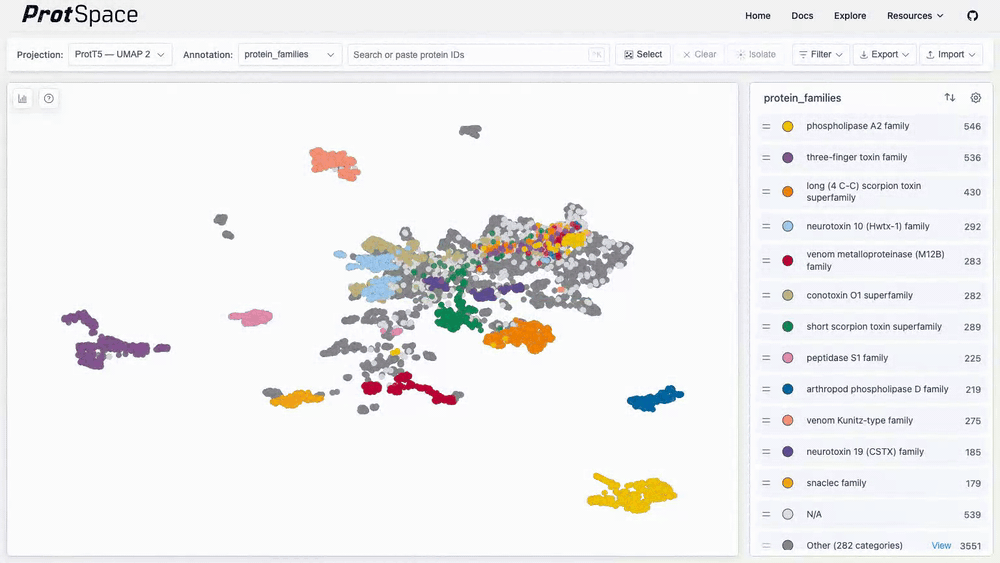
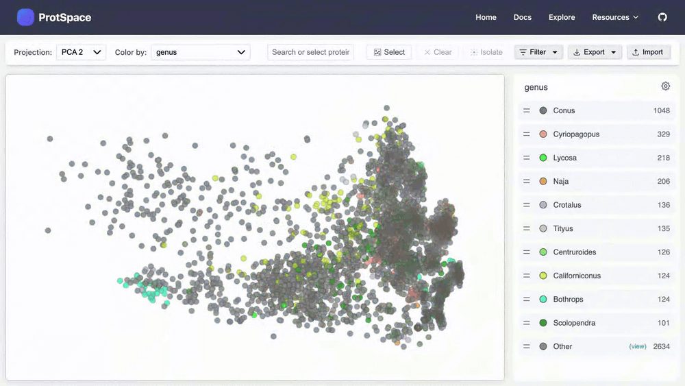

# Using the Legend

The legend panel lets you filter, customize, and explore protein annotations. Most annotations are categorical, but scalar numeric annotations such as `length` are handled a little differently.

## Show And Hide Values

Click any legend row to toggle its visibility:

- Click once to hide that value.
- Click again to show it.
- Double-click to isolate that value and hide the rest.
- If only one value remains visible, clicking it restores the full set.

## Reordering And Draw Order

Drag labels up or down to change draw order in the scatterplot. Items near the top are drawn on top of items below them.

The drag handle stays visible in each legend row so manual ordering is easy to discover. Dragging from any sort mode switches that annotation to `Manual order`.

## The "Other" Group

Categorical annotations can group less frequent values into `Other` once the visible list exceeds the current legend cap.

- Click `Other` to inspect the grouped values.
- Extract values from `Other` to show them separately.
- Drag values into `Other` to regroup them.

Numeric annotations do **not** use `Other`. They are binned directly from the raw numeric values.

## Settings

Click the cog icon in the top-right corner of the legend for advanced options.

### Shared Settings

| Setting                     | What it does                                                                                                                                |
| --------------------------- | ------------------------------------------------------------------------------------------------------------------------------------------- |
| **Max legend items**        | Categorical annotations: maximum number of visible values before grouping into `Other`. Numeric annotations: target maximum number of bins. |
| **Shape size / Point size** | Adjusts marker size in the scatterplot. Numeric annotations use the label `Point size` because numeric legends always render circles.       |
| **Include shapes**          | Enables per-category shapes for categorical annotations. Disabled for multi-label and numeric annotations.                                  |
| **Show duplicate counts**   | Shows duplicate count badges and spreads overlapping points when you expand them.                                                           |
| **Color palette**           | Picks the active palette for the selected annotation.                                                                                       |

### Sorting

Categorical annotations support three sort modes:

- `By category size`
- `Alphabetical`
- `Manual order`

Numeric annotations support two sort modes:

- `By numeric value`
- `Manual order`

The arrow button next to the cog reverses the current sort direction:

- Numeric `By numeric value`: low-to-high vs high-to-low
- Numeric `Manual order`: reverses the current manual order
- Categorical: preserves the legacy reverse behavior

### Numeric Bin Distribution

When the selected annotation is numeric and a numeric gradient palette is active, an extra `Bin distribution` control appears:

- `Linear`
- `Quantile`
- `Logarithmic`

`Logarithmic` is only available when all non-null values are strictly positive. If the data contains `0` or negative values, ProtSpace falls back to linear binning.

### Reverse Gradient Direction

Numeric annotations also expose a `Reverse gradient direction` toggle in the settings dialog.

- Off: lower numeric values use the low end of the selected gradient and higher values use the high end.
- On: the gradient is flipped so higher numeric values receive the colors that would normally be used for lower values, and vice versa.

This setting is saved with the rest of the numeric legend settings and is restored on reload or bundle import.

## Numeric Annotations

Scalar numeric annotations are stored as raw numbers and binned in the browser from the current numeric settings.

### Numeric Labels

Numeric legend labels are display summaries for humans:

- They use `min - max` formatting instead of comparison syntax like `<`.
- Integer-only data stays integer-only in the legend.
- Decimal labels only appear when the source data actually needs decimal precision.
- Single-value bins are shown as a single number.

The exact runtime bin edges are still used for membership. The displayed label is a summary of the values observed in that bin.

### Why Fewer Bins Can Appear Than The Max

For numeric annotations, `Max legend items` is a target cap, not a hard guarantee. You can request `10` bins and still see fewer when the data does not support all of them.

Common reasons:

- A linear or logarithmic interval ends up empty, so it is dropped from the realized legend.
- Quantile cut points collapse because many proteins share the same value.
- A constant numeric column produces exactly one bin.
- An all-null numeric column produces zero bins.
- Very narrow ranges can collapse after precision/topology normalization.

This is why you might see `10` requested bins become `9`, and `9` become `8`, without anything being wrong.

## Colors, Gradients, And Shapes

### Categorical Palettes

Categorical annotations use discrete palettes. ProtSpace keeps the established categorical options for contrast and colorblind safety:

- Kelly's Colors
- Okabe-Ito
- Tol Bright
- Set2
- Dark2
- Tableau 10

Colors stay attached to categories when you reorder them.

### Numeric Gradients

Gradients are only shown for numeric annotations. ProtSpace currently ships five curated sequential gradients:

- `Cividis`: colorblind-friendly default for ordered numeric data
- `Viridis`: balanced perceptually uniform sequential gradient
- `Inferno`: high-contrast dark-to-bright ramp
- `Batlow`: scientific-publication oriented sequential ramp from Fabio Crameri's Scientific Colour Maps
- `Plasma`: vivid exploratory sequential ramp

These were chosen because they are either perceptually uniform, publication-friendly, accessibility-aware, or visually distinctive for ordered data. Rainbow-style maps are intentionally excluded because they are a poor default for numeric interpretation.

Numeric bin colors are derived from the gradient and the selected distribution. They are not manually edited per bin.

If an imported bundle or saved browser state references an unsupported numeric gradient ID, ProtSpace falls back to `cividis`.

### Special Categories

| Category  | Color     | Shape  |
| --------- | --------- | ------ |
| **Other** | `#999999` | Circle |
| **N/A**   | `#DDDDDD` | Circle |

### Shapes

When shapes are enabled for categorical data, categories cycle through:

1. Circle
2. Square
3. Diamond
4. Plus
5. Triangle-up
6. Triangle-down

Shapes are disabled for multi-label annotations and numeric annotations.

## Saved Settings

Legend settings are saved per dataset and per annotation in the browser.

- Saved examples: visibility, palette, ordering, numeric binning settings, and duplicate-count preferences
- Numeric binning settings such as palette, gradient direction, strategy, and target bin count are restored on reload/import
- Numeric hidden values and manual order are only restored when the current numeric topology still matches the saved one
- Use `Reset` in the settings dialog to clear saved preferences for the selected annotation

## Multi-Label Annotations

When proteins have multiple values, such as multiple EC numbers:

- Points display as pie charts
- Each slice represents one value
- All unique values appear in the legend

## Next Steps

- [Control Bar Features](/explore/control-bar) - projections, filters, export, and import
- [Viewing 3D Structures](/explore/structures) - AlphaFold integration
