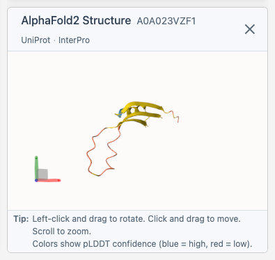

# Viewing 3D Structures

ProtSpace integrates with AlphaFold to display 3D protein structures alongside your embedding visualization.

## How It Works

When you select a protein with a UniProt accession:

1. The structure viewer appears in the sidebar below the legend
2. Links to [AlphaFold Database](https://alphafold.ebi.ac.uk/), [UniProt](https://www.uniprot.org/), and [InterPro](https://www.interpro.org/) appear at the top - click them anytime
3. The AlphaFold structure file is fetched directly from the [AlphaFold Database API](https://alphafold.ebi.ac.uk/api-docs); the [3D-Beacons API](https://www.ebi.ac.uk/pdbe/pdbe-kb/3dbeacons/) is used only to look up the model page link

::: tip Supported Structures
Currently, ProtSpace supports **AlphaFold structures** only. PDB experimental structures are not yet integrated.
:::

## Confidence Coloring (pLDDT)

Structures are colored by **predicted Local Distance Difference Test (pLDDT)** confidence scores—the same scheme used on the [AlphaFold Database](https://alphafold.ebi.ac.uk/). Regions in **blue** are high-confidence, **yellow** moderate, and **red** low-confidence. This helps you quickly spot which parts of the model are more reliable.

## Viewer Controls

| Action           | Effect               |
| ---------------- | -------------------- |
| **Left drag**    | Rotate the structure |
| **Right drag**   | Pan the view         |
| **Scroll**       | Zoom in/out          |
| **Double-click** | Reset the view       |

## When Structures Aren't Available

Not all proteins have AlphaFold structures. When no structure is found, the viewer displays:

> "No 3D structure was found for \<Protein ID\>"

## Next Steps

- [Exporting Results](/explore/exporting) - Save your findings
- [FAQ](/guide/faq) - Common questions
